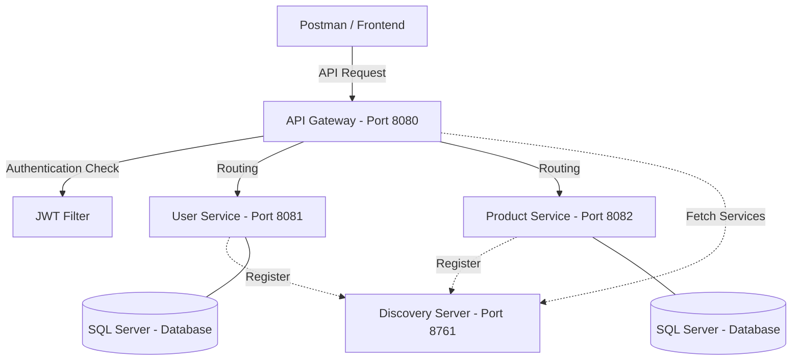

# 🎮 GameStore Microservices Architecture

Dự án chuyển đổi từ hệ thống Monolithic sang kiến trúc **Microservices** hiện đại, tập trung vào khả năng mở rộng, bảo mật và hiệu suất cao. Phù hợp cho các hệ thống E-commerce quy mô lớn.

## 🏗️ Kiến trúc hệ thống (System Architecture)



## 🚀 Tính năng nổi bật (Key Features)

- **Service Discovery (Eureka):** Các dịch vụ tự động đăng ký và tìm thấy nhau, không cần hard-code địa chỉ.
- **API Gateway (Spring Cloud Gateway):** Trung tâm điều hướng mọi yêu cầu, tăng tính bảo mật và quản lý tập trung.
- **Bảo mật JWT (JSON Web Token):** Hệ thống Stateless Authentication giúp bảo vệ dữ liệu và xác thực người dùng an toàn.
- **Standardized Java 17:** Sử dụng phiên bản Java LTS ổn định nhất hiện nay.
- **Global Exception Handling:** Xử lý lỗi tập trung, trả về JSON chuẩn xác cho Frontend.

## 🛠️ Công nghệ sử dụng (Tech Stack)

- **Backend:** Java 17, Spring Boot 3.3.4
- **Microservices:** Spring Cloud Gateway, Netflix Eureka
- **Database:** SQL Server (GearHost)
- **Security:** Spring Security, JJWT (JSON Web Token)
- **Tools:** Maven, Git, Postman

## 🚦 Hướng dẫn cài đặt (Installation)

1. **Clone dự án:**
   ```bash
   git clone https://github.com/[Your-Username]/gamestore-microservices.git
   ```
2. **Khởi động các Service theo đúng thứ tự:**
   - `microservices/discovery-server`: `./mvnw spring-boot:run`
   - `microservices/user-service`: `./mvnw spring-boot:run`
   - `microservices/product-service`: `./mvnw spring-boot:run`
   - `microservices/gateway-service`: `./mvnw spring-boot:run`

3. **Cấu hình Database:** Cập nhật thông tin trong file `application.properties` của từng service để kết nối tới SQL Server của bạn.

## 🛡️ API Endpoints

| Service | Method | Path | Auth |
| :--- | :--- | :--- | :--- |
| **User** | POST | `/api/users/register` | Open |
| **User** | POST | `/api/users/login` | Open |
| **Product** | GET | `/api/products` | **JWT Required** |

---
*Dự án được xây dựng bởi [Tên của bạn] - 2026.*
