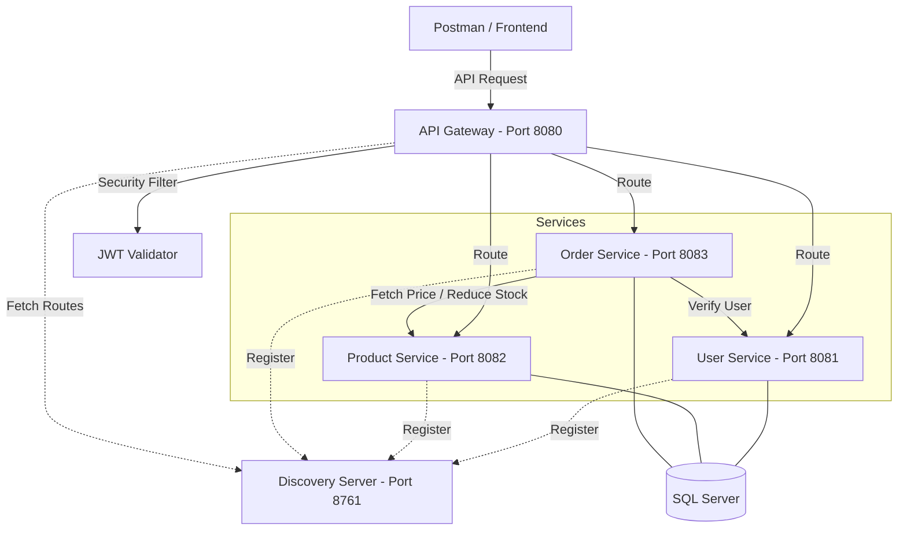

# 🎮 GameStore Microservices Architecture (Level: Intern Xịn)

Dự án này là một nền tảng Thương mại điện tử (E-commerce) hoàn chỉnh được xây dựng trên kiến trúc **Microservices** hiện đại, sử dụng Java 17 và Spring Cloud.

## 🏗️ Kiến trúc hệ thống (System Architecture)



## 🚀 Tính năng nổi bật (Key Features)

- **Order Management:** Quy trình đặt hàng hoàn chỉnh, tự động xác thực User và trừ tồn kho Sản phẩm qua OpenFeign.
- **Inter-service Communication:** Sử dụng **OpenFeign** để các service giao tiếp với nhau một cách chuyên nghiệp.
- **Service Discovery (Eureka):** Quản lý tập trung các instance của dịch vụ.
- **API Gateway (Spring Cloud Gateway):** Điều phối request và bảo mật tập trung cho toàn hệ thống.
- **Bảo mật JWT:** Hệ thống Stateless Authentication an toàn tuyệt đối.
- **Full Dockerized:** Triển khai thần tốc với Docker Compose chỉ bằng một dòng lệnh.

## 🛠️ Công nghệ sử dụng (Tech Stack)

- **Backend:** Java 17, Spring Boot 3.3.4
- **Spring Cloud:** Gateway, Eureka, OpenFeign
- **Database:** SQL Server (GearHost)
- **Container Interface:** Docker, Docker Compose
- **Security:** JWT, Spring Security

## 📸 Demo quy trình thực tế (The Proof)

Dưới đây là chu kỳ hoạt động khép kín của hệ thống thông qua bộ lọc bảo mật của API Gateway:

| BƯỚC 1: Đăng nhập nhận JWT | BƯỚC 2: Kiểm tra kho hàng |
| :---: | :---: |
|  |  |
| *Xác thực danh tính qua User Service* | *Lấy thông tin hàng hóa hiện có* |

| BƯỚC 3: Đặt hàng thông minh | BƯỚC 4: Đồng bộ kho tự động |
| :---: | :---: |
|  |  |
| *Order Service kết nối Inter-service* | *Kho hàng tự giảm 1 SAU KHI chốt đơn* |

---
## 🚦 Cách chạy thử (Getting Started)

### 🐳 Cách 1: Sử dụng Docker (Nhanh nhất)
1. Cài đặt Docker & Docker Compose.
2. Chạy lệnh tại thư mục gốc:
   ```bash
   docker-compose up --build
   ```

### 💻 Cách 2: Chạy trực tiếp (Local)
1. Bật **Discovery Server** (8761)
2. Bật **User Service** (8081), **Product Service** (8082), **Order Service** (8083)
3. Cuối cùng, bật **Gateway Service** (8080) làm lối vào duy nhất.

---
*Dự án tâm huyết bởi Nguyen Dang Vu - 2026.*
