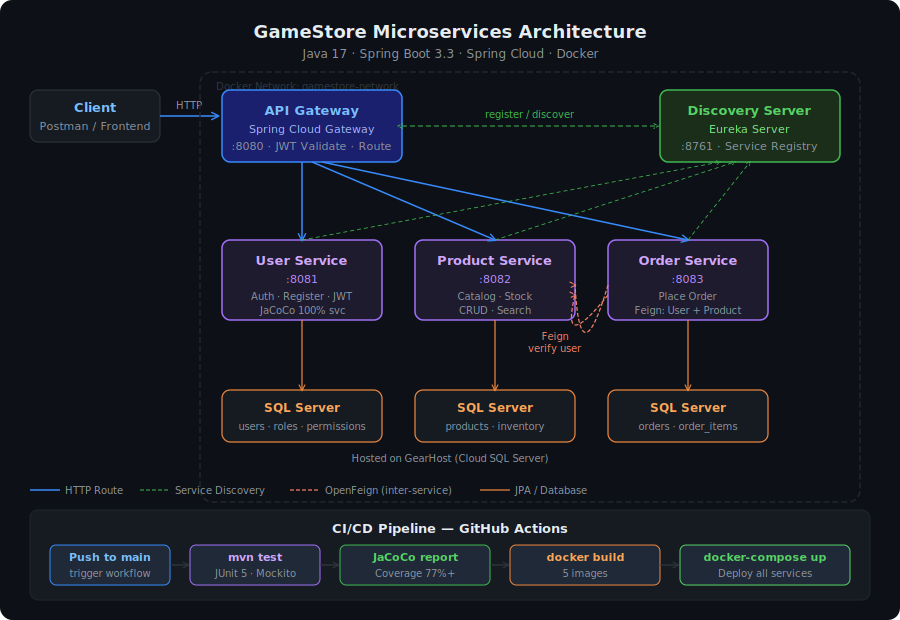
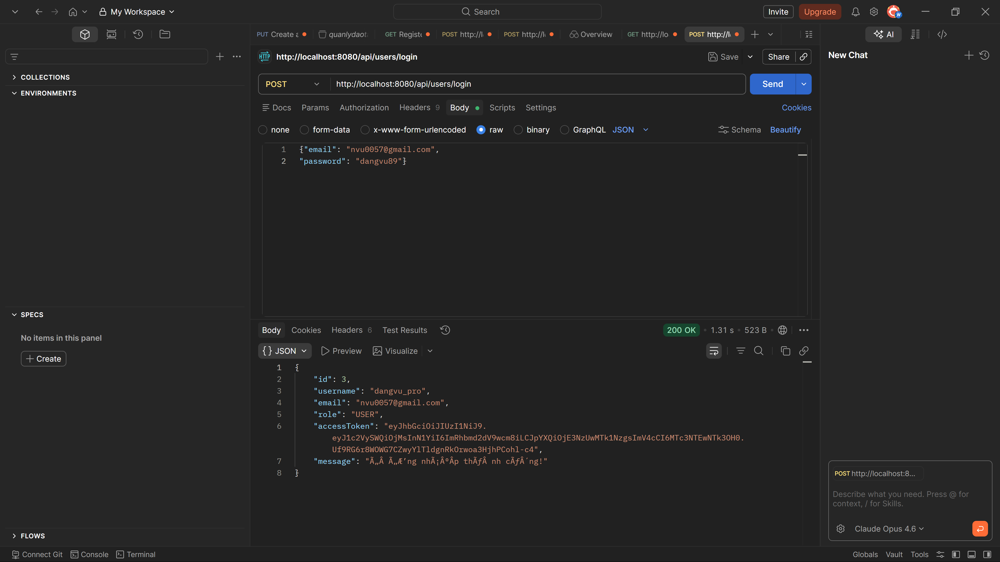
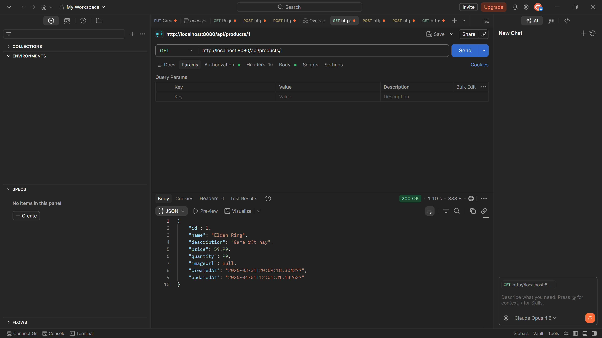
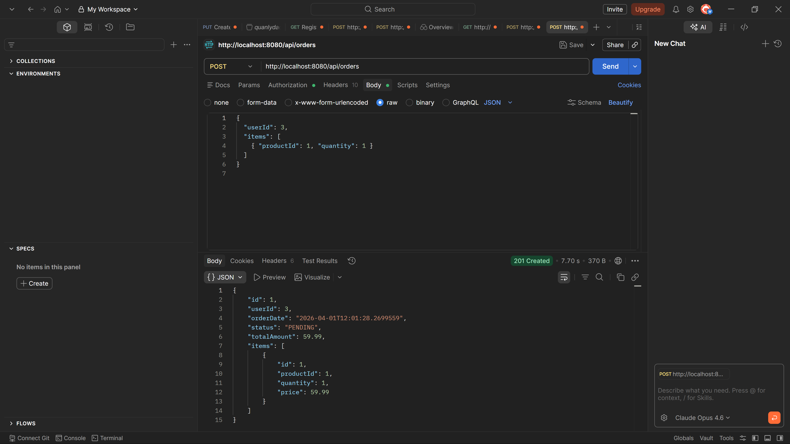
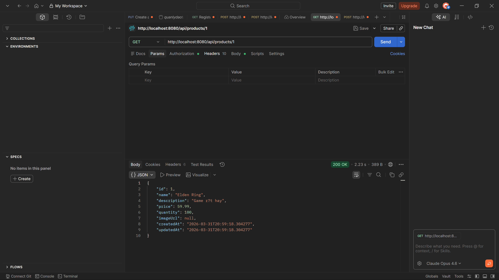
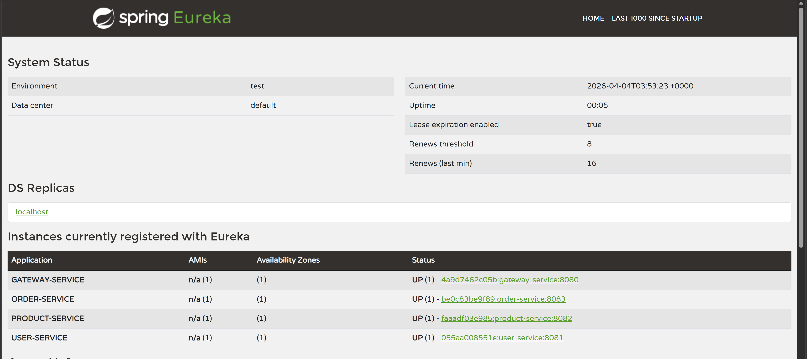
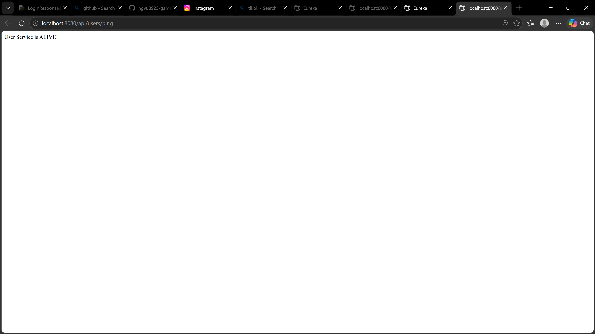

# 🎮 GameStore Microservices Architecture (Level: Intern Xịn)

[](https://www.oracle.com/java/)
[](https://spring.io/projects/spring-boot)
[](https://www.docker.com/)
[](https://opensource.org/licenses/MIT)

Dự án này là một nền tảng Thương mại điện tử (E-commerce) hoàn chỉnh được xây dựng trên kiến trúc **Microservices** hiện đại, sử dụng Java 17 và Spring Cloud. Hệ thống đã được tối ưu hóa cho môi trường Container và có độ phủ Test cao.

## 🏗️ Kiến trúc hệ thống (System Architecture)



Hệ thống được thiết kế theo mô hình Microservices hiện đại, tối ưu cho việc mở rộng và bảo mật. Toàn bộ các yêu cầu từ Client đều đi qua **API Gateway** để thực hiện xác thực JWT trước khi được điều phối đến các dịch vụ nội bộ.


## 🚀 Tính năng nổi bật (Key Features)

- **Order Management:** Quy trình đặt hàng hoàn chỉnh, tự động xác thực User và trừ tồn kho Sản phẩm qua OpenFeign.
- **Inter-service Communication:** Sử dụng **OpenFeign** để các service giao tiếp với nhau một cách chuyên nghiệp.
- **Service Discovery (Eureka):** Quản lý tập trung các instance của dịch vụ.
- **API Gateway (Spring Cloud Gateway):** Điều phối request và bảo mật tập trung cho toàn hệ thống.
- **Bảo mật JWT:** Hệ thống Stateless Authentication an toàn tuyệt đối.
- **Full Dockerized:** Triển khai thần tốc với Docker Compose chỉ bằng một dòng lệnh.
- **Unit & Integration Testing:** Đạt độ phủ mã nguồn (Code Coverage) cao, đảm bảo tính ổn định.

## 🛠️ Công nghệ sử dụng (Tech Stack)

- **Backend:** Java 17, Spring Boot 3.3.4
- **Spring Cloud:** Gateway, Eureka, OpenFeign
- **Database:** SQL Server (GearHost)
- **Container Interface:** Docker, Docker Compose
- **Testing:** JUnit 5, Mockito, Testcontainers, JaCoCo
- **Security:** JWT, Spring Security

## 📸 Demo & Screenshots

### 🛒 Quy trình nghiệp vụ thực tế (Business Flow)

Dưới đây là chu kỳ hoạt động khép kín của hệ thống thông qua bộ lọc bảo mật của API Gateway:

| BƯỚC 1: Đăng nhập nhận JWT | BƯỚC 2: Kiểm tra kho hàng |
| :---: | :---: |
|  |  |
| *Xác thực danh tính qua User Service* | *Lấy thông tin hàng hóa hiện có* |

| BƯỚC 3: Đặt hàng thông minh | BƯỚC 4: Đồng bộ kho tự động |
| :---: | :---: |
|  |  |
| *Order Service kết nối Inter-service* | *Kho hàng tự giảm SAU KHI chốt đơn* |

### 🐳 Triển khai thực tế trên Docker (Deployment Proof)

Hệ thống đã được kiểm chứng hoạt động ổn định trên môi trường Docker Container:

*   **Bảng điều khiển Eureka (Discovery Dashboard):** Toàn bộ các service đăng ký thành công (UP).  
    
*   **API Gateway Routing:** Kiểm tra kết nối thông qua Gateway tới User Service.  
    

---

## 📅 Nhật ký dự án (Core Progress)

- [x] **GIAI ĐOẠN 1: Phát triển Microservices CORE** (Hoàn tất)
- [x] **GIAI ĐOẠN 2: Triển khai Testing & Coverage** (Hoàn tất)
  - Unit Test UserService, ProductService (JUnit 5 + Mockito).
  - Integration Test OrderService (Feign Mock + Testcontainers).
  - Cấu hình JaCoCo báo cáo độ phủ mã nguồn.
- [x] **GIAI ĐOẠN 3: Containerization (Docker)** (Hoàn tất)
  - Viết Dockerfile tối ưu cho Java 17.
  - Cấu hình Docker Compose kết nối mạng nội bộ giữa các service.
- [ ] **GIAI ĐOẠN 4: Frontend Development** (Sẽ sớm triển khai)

---

## 🚦 Cách chạy thử (Getting Started)

### 🐳 Sử dụng Docker (Khuyên dùng)
1. Cài đặt Docker & Docker Compose.
2. Tại thư mục gốc, copy file `.env.example` thành `.env` và điền cấu hình Database.
3. Chạy lệnh:
   ```bash
   docker-compose up --build
   ```
4. Truy cập Eureka Dashboard tại: `http://localhost:8761`

### 💻 Chạy Local (Yêu cầu Java 17+)
1. `mvn clean package -DskipTests` tại từng thư mục service.
2. Lần lượt chạy các file JAR hoặc chạy trực tiếp từ IDE theo thứ tự: Discovery -> User/Product/Order -> Gateway.

---
*Dự án tâm huyết bởi Nguyen Dang Vu - 2026.*
